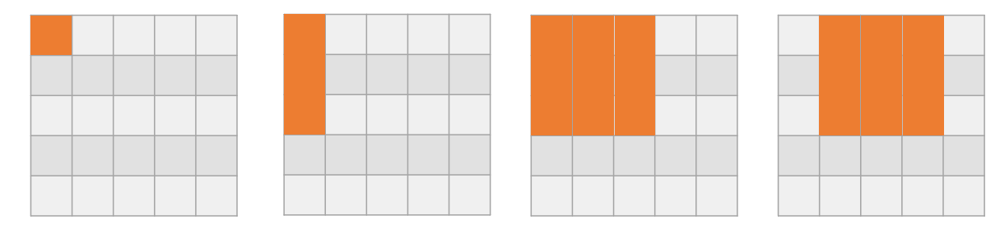

# Problem
[Chapter05 A,B]  
출처: 알고리즘 문제 해결 기법 입문  

(문제생략)  

* * * 

> 예전에 틀렸던 문제들이나 헷깔렸던 문제들 다시 풀어보고 있는데 쉽게 풀리는 문제도 있고 잘 안 풀리는 문제도 있다. 문제 자체는 for문 쓰면 간단한데, 시간 복잡도 줄이는 방법을 고민해보면 좋을 듯.

# Code  

### 단순 풀이
~~~java

import java.util.Scanner;

public class Problem5A {
    public static final Scanner scanner = new Scanner(System.in);

    public static void testCase(){
        //기본 입력
        int n = scanner.nextInt();
        int k = scanner.nextInt();
        int[][] space = new int[n][n];

        for(int i = 0 ; i < n ; i++){
            for(int j = 0 ; j < n ; j++){
                space[i][j] = scanner.nextInt();
            }
        }

        //알고리즘 시작
        int answer = Integer.MAX_VALUE;
        for(int i = 0 ; i + k <= n ; i++){
            for(int j = 0 ; j + k <= n; j++){
                int temp = 0;
                for(int dx = 0 ; dx < k ; dx++){
                    for(int dy = 0; dy < k ; dy++){
                        if(space[i+dx][j+dy] == 1) temp++;
                    }
                }
                answer = Math.min(answer,temp);
            }
        }

        System.out.println(answer);
    }

    public static void main(String[] args){
        int tc = scanner.nextInt();
        for(int i = 0 ; i < tc ; i++){
            testCase();
        }
    }
}
~~~

### 최적화
~~~java

import java.util.Scanner;

public class Problem5B {
    public static final Scanner scanner = new Scanner(System.in);

    public static void testCase(int caseIndex){
        //기본 입력
        int n = scanner.nextInt();
        int k = scanner.nextInt();
        int[][] space = new int[n][n];
        for(int r = 0 ; r < n ; r++){
            for(int c = 0 ; c < n ; c++){
                space[r][c] = scanner.nextInt();
            }
        }

        int answer = Integer.MAX_VALUE;

        for(int r = 0 ; r + k -1 < n ; r++){
            int minRow = r;
            int maxRow = r+k-1;
            int sum = 0;

            for(int c = 0 ; c < n ; c++){
                for(int i = minRow ; i <= maxRow; i++){
                    if(space[i][c] == 1){
                        sum++;
                    }
                    if(c > 0 && c-k+1 > 0 ){
                        if(space[i][c-k] == 1){
                            sum--;
                        }
                    }
                }
                if(c-k+1>=0){
                    answer = Math.min(answer, sum);
                }
            }
        }

        System.out.println(answer);
    }

    public static void main(String[] args) throws Exception {
        int tc = scanner.nextInt();
        for(int i = 0 ; i < tc ; i++){
            testCase(i);
        }
    }
}

~~~

# Explanation  

단순 풀이는 크게 생각할 것이 없는 것 같다. 입력 데이터의 숫자 범위 생각 안 하고 4중 for문 쓰면 O(N^4) 정도 걸리면서 풀릴텐데 그렇게 좋은 방법은 아닌 것 같다.

* r을 고정시키고 c에 `sliding window`를 적용 시켜서 for문을 돌리면 3중 for문으로 줄일 수 있다.  
칸을 순회하는 순서를 나타내면 다음과 같다.

* 인덱스 i부터 연속된 k번째 원소의 인덱스 **i+k-1**. 계산해도 좋으나 자주 사용하니까 기억하자.

# ect...
생략.